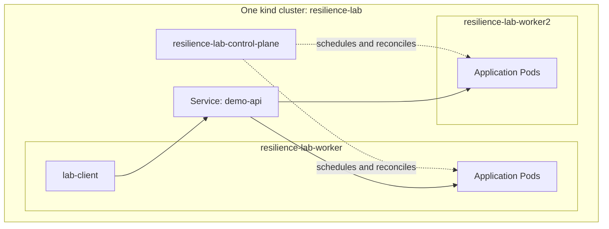

# Kubernetes resilience and scaling lab

Five experiments on one laptop: discover Service backends, scale replicas, replace a deleted Pod, drain a worker, and roll from `v1` to `v2`. The Go application only identifies the Pod, node, and version serving a request.

**Validation status (6 October 2026):** All required first-milestone code is present. Go `1.27.0` tests, race checks, vet, builds, server-side manifest validation, image loading, and baseline deployment passed. Service distribution, scaling, and Pod replacement also passed with recorded traffic. The owner stopped the containers during the drain experiment; drain completion, the `v1` → `v2` rollout, and final reset remain unverified. See the measured results and remaining checklist below.

## Topology and prerequisites

Run all commands in Bash inside WSL2, from `/home/phu/kubernetes-resilience-lab` unless indicated otherwise. Keep the project in the WSL filesystem. GoLand is optional; do not mix Windows and WSL Docker contexts, `kubectl`, or kubeconfig files. The separate upstream Kubernetes checkout is not used.

Required tools are Go, Docker Desktop integrated with WSL, kind, `kubectl`, Bash, and standard Ubuntu utilities including `timeout`, `awk`, and `tee`. No application image registry, Helm, Kubernetes source build, or additional CLI package is needed. Base-image downloads require registry access.

| Component | Fixed value |
| --- | --- |
| Cluster / context / namespace | `resilience-lab` / `kind-resilience-lab` / `resilience-lab` |
| Go module and builder | Go `1.27.0`; `golang:1.27.0-alpine` |
| Runtime image | `alpine:3.24.0` |
| Application images | `demo-api:v1`, `demo-api:v2` |
| Observer image | `curlimages/curl:8.18.0` |
| Kubernetes node image, all nodes | `kindest/node:v1.36.4@sha256:099e049362a1526b2db71494e1947aae99bd16290d7c895f2b7ea312e3cbfaed` |
| Existing client tools | `kubectl 1.36.2`; kind `0.34.0-alpha` |

Keep the installed kind if it works. If its alpha build causes a reproducible failure, record the error before using the specified fallback, stable kind `v0.33.0`. Do not silently change pinned images or tool versions.

There are **three total nodes: one control plane and two workers**. Each kind node is a Docker container. Application Pods run on the workers, and the traffic observer stays on worker 1. Reserve sufficient Docker/WSL resources for all three nodes and an additional application replica during a rollout; diagnose actual resource pressure rather than reducing the topology.



Placement is a preference: three replicas usually split two/one across the workers, but exact counts are observed rather than guaranteed. The Service is a virtual network abstraction. All nodes share the laptop; the lab does not survive loss of Docker Desktop or the laptop. Draining a worker demonstrates planned maintenance.

## Setup, in order

The script commands are the recommended path. Raw equivalents are provided for learning or manual execution; do not run both creation paths. Scripts resolve their own paths and work from another directory. Each Kubernetes operation explicitly targets `kind-resilience-lab`, and namespaced operations target `resilience-lab`. The scripts preserve your existing current context.

Define this helper in every terminal used for manual commands:

```bash
k() { kubectl --context kind-resilience-lab --namespace resilience-lab "$@"; }
```

1. **Confirm Docker access first.** Start Docker Desktop on Windows, then run inside WSL:

   ```bash
   docker version
   docker info
   ```

   `docker version` must show both Client and Server. If access still fails after Desktop finishes starting, check its WSL2 engine and integration for this distribution before creating a cluster. On the verified laptop, Ubuntu integration was already enabled; starting Desktop restored access without changing settings. Do not install a second WSL Docker daemon as a workaround. See [Docker's WSL instructions](https://docs.docker.com/desktop/features/wsl/).

2. **Check prerequisites and existing resources.**

   ```bash
   scripts/lab.sh doctor
   ```

   This is read-only. The basic raw checks are:

   ```bash
   go version
   kubectl --context kind-resilience-lab version --client
   kind version
   docker info
   kind get clusters
   kubectl --context kind-resilience-lab config get-contexts kind-resilience-lab
   ```

   If the context already exists, inspect `kubectl --context kind-resilience-lab get nodes -o wide` and `kubectl --context kind-resilience-lab version`. The required Go version is `1.27.0`; use that version or allow Go's toolchain selection to retrieve it when available. An unavailable exact toolchain or image is a prerequisite blocker, not permission to change the pin.

3. **Create or verify the named cluster.**

   ```bash
   scripts/lab.sh up
   kubectl --context kind-resilience-lab get nodes -o wide
   ```

   `up` reuses a compatible existing cluster, rejects an incompatible topology/version, and never silently recreates it. Verify exactly the three expected node names, all Ready.

   For an **absent** cluster, the raw creation path below uses a separate ignored kubeconfig so your existing configuration is untouched:

   ```bash
   mkdir -p results
   kind create cluster --name resilience-lab --config kind/cluster.yaml --wait 240s \
     --kubeconfig results/kubeconfig
   export KUBECONFIG="$PWD/results/kubeconfig"
   kubectl --context kind-resilience-lab wait --for=condition=Ready nodes --all --timeout=120s
   kubectl --context kind-resilience-lab label node \
     resilience-lab-worker resilience-lab-worker2 \
     lab.example.com/role=worker --overwrite
   kubectl --context kind-resilience-lab get nodes -o wide
   ```

   If choosing this raw path, set `KUBECONFIG` to that absolute file path in **each** terminal. Keep this generated credential file out of Git. Retain the default control-plane scheduling taint.

4. **Test, build, and load images.**

   ```bash
   go test ./...
   for script in scripts/*.sh; do bash -n "$script" || exit; done
   scripts/lab.sh build
   ```

   Raw image commands, from the repository root:

   ```bash
   docker build -f app/Dockerfile --build-arg VERSION=v1 -t demo-api:v1 .
   docker build -f app/Dockerfile --build-arg VERSION=v2 -t demo-api:v2 .
   docker pull curlimages/curl:8.18.0
   kind load docker-image --name resilience-lab \
     demo-api:v1 demo-api:v2 curlimages/curl:8.18.0
   ```

   Both versions use identical source with `main.version` baked into the binary. A host Docker image is not automatically present in kind: loading into the named cluster populates every node. The application and observer use `imagePullPolicy: Never`. Treat each tag as fixed for a run. After source changes, rebuild, reload, and recreate the Pods before retesting; `scripts/lab.sh reset` restarts the application.

5. **Validate manifests, deploy, and inspect status.**

   Apply the namespace before the server-side dry-run:

   ```bash
   k apply -f k8s/namespace.yaml
   k apply --dry-run=server \
     -f k8s/deployment.yaml -f k8s/service.yaml -f k8s/pdb.yaml -f k8s/client.yaml
   scripts/lab.sh deploy
   scripts/lab.sh status
   ```

   Raw deployment equivalents:

   ```bash
   k apply -f k8s/namespace.yaml
   k apply -f k8s/deployment.yaml -f k8s/service.yaml -f k8s/pdb.yaml -f k8s/client.yaml
   k rollout status deployment/demo-api --timeout=120s
   k wait --for=condition=Ready pod/lab-client --timeout=120s
   kubectl --context kind-resilience-lab get nodes
   k get deployment,replicaset,pods,service,pdb -o wide
   k get endpointslices -l kubernetes.io/service-name=demo-api -o yaml
   ```

   Confirm three non-terminating Ready app Pods, three ready Service backends, both workers used, and a Ready observer on worker 1. Never recursively apply `k8s/`: optional resources must not become active accidentally. A successful dry-run does not prove a working deployment.

6. **Send a request through the Service.**

   ```bash
   timeout 8s kubectl --context kind-resilience-lab --namespace resilience-lab \
     exec lab-client -- curl --silent --show-error --http1.1 \
     --header 'Connection: close' --connect-timeout 1 --max-time 2 \
     http://demo-api.resilience-lab.svc.cluster.local/
   ```

   Confirm three newline-terminated identity fields: `pod`, `node`, and `version: v1`; names must match actual Pods and nodes. Do not use `kubectl port-forward service/demo-api` to measure distribution or availability: it selects a Pod instead of exercising Service routing across the replicas.

7. **Start the Service experiment below.** Do not begin a disruption experiment with an unhealthy baseline.

## Observing and collecting evidence

Use three terminals: A for bounded traffic, B for watching Pods, and C for the selected experiment and resource inspection. Run experiments deliberately and separately. `demo.sh` verifies Kubernetes object state; its exit code alone cannot establish traffic acceptance. Scripts print boundary timestamps and leave failed experiment state available for inspection.

In terminal A, capture traffic for the experiment being run. Use distinct filenames for each run; `tee` overwrites an existing file.

```bash
mkdir -p results
set -o pipefail
scripts/load.sh traffic 120 | tee results/service-traffic.csv
# For each later experiment, start its own capture before the mutation:
# scripts/load.sh traffic 600 | tee results/scale-traffic.csv
# scripts/load.sh traffic 600 | tee results/self-heal-traffic.csv
# scripts/load.sh traffic 600 | tee results/drain-traffic.csv
# scripts/load.sh traffic 600 | tee results/rollout-traffic.csv
```

`traffic` defaults to 600 seconds and accepts `1..3600`. Every attempt starts a new curl process inside `lab-client`, uses HTTP/1.1 with `Connection: close`, a one-second connect timeout, and a two-second request timeout. A host `timeout` bounds each exec attempt to eight seconds. A 0.2-second pause follows each attempt. There are no automatic retries. Ctrl+C stops the observer; there is no persistent remote traffic loop. Diagnostics and the final counts go to stderr; stdout is CSV:

```text
timestamp_utc,exec_exit,http_code,seconds,pod,node,version
```

Success requires **both** exit code `0` and HTTP `200`. HTTP status `000` means unavailable; missing timing/identity is `-`. `seconds` is curl request time, excluding exec overhead. Failed attempts remain in the trace, including API/exec timeout exit codes. This is an observation workload, not a throughput benchmark.

In terminal B:

```bash
k get pods -l app=demo-api -o wide --watch
```

Stop the watch with Ctrl+C. In terminal C, inspect these fields before and after each mutation:

```bash
k get deployment,replicaset,pdb
k get pods -l app=demo-api -o wide
k get service demo-api -o jsonpath='{.metadata.uid}{"\t"}{.spec.clusterIP}{"\n"}'
k get endpointslices -l kubernetes.io/service-name=demo-api \
  -o jsonpath='{range .items[*].endpoints[*]}{.targetRef.name}{"\t"}{.addresses[0]}{"\t"}{.conditions.ready}{"\n"}{end}'
k get events --sort-by=.lastTimestamp
```

Count **ready endpoints**, not every listed address. An unhealthy or terminating Pod may still appear in an EndpointSlice with readiness false. Ordinary Service traffic follows readiness. Save script output with `scripts/demo.sh NAME 2>&1 | tee results/NAME-state.txt`; use `set -o pipefail` in that terminal so `tee` does not hide script failures.

Review a CSV with standard tools, substituting its actual filename:

```bash
awk -F, 'NR > 1 {n++; if ($2 == 0 && $3 == 200) ok++; else bad++}
  END {printf "attempts=%d successes=%d failures=%d\n", n, ok, bad}' results/service-traffic.csv
awk -F, 'NR > 1 && $2 == 0 && $3 == 200 {print $5, $6, $7}' \
  results/service-traffic.csv | sort | uniq -c
awk -F, 'NR == 1 || $2 != 0 || $3 != 200' results/service-traffic.csv
```

Match the CSV UTC timestamps to script boundaries, and inspect successful identity rows during each transition. Record approximate creation time separately from time to restored readiness. Keep before/after state, mutation commands, times, and counts in `results/`, which is ignored. A trace with zero failures means none were observed at this sampling rate, not that every possible connection would have succeeded.

## The five experiments

### 1. Deployment, Service, and backend discovery

Start from three Ready `v1` app Pods using both workers, a Ready client, and no HPA. In terminal C:

```bash
scripts/demo.sh service
```

This command is read-only. Collect at least **100 independent requests**, initially with the 120-second traffic command above. If exec overhead yields fewer attempts, extend collection; if one backend is missed, make one longer sample and inspect selectors/connections before diagnosing a failure.

Manual observations:

```bash
k get service demo-api -o wide
k get pods -l app=demo-api -o wide
k get pods -l app=demo-api \
  -o jsonpath='{range .items[*]}{.metadata.name}{"\t"}{.metadata.uid}{"\t"}{.metadata.ownerReferences[0].kind}{"/"}{.metadata.ownerReferences[0].name}{"\n"}{end}'
k get replicasets -l app=demo-api \
  -o jsonpath='{range .items[*]}{.metadata.name}{"\t"}{.metadata.ownerReferences[0].kind}{"/"}{.metadata.ownerReferences[0].name}{"\n"}{end}'
k get endpointslices -l kubernetes.io/service-name=demo-api -o yaml
```

**Pass:** three active Ready replicas and three ready backends; all three Pod names appear in successful responses through the same Service; all versions are `v1`; no baseline request failures. Relate Pod IPs to EndpointSlice addresses. Distribution need not be equal or round-robin. The Service selector discovers ready backends; the Deployment owns ReplicaSets, and the active ReplicaSet owns and maintains the Pods.

### 2. Scale three to six to three

Proceed after experiment 1 passes, with no HPA. Start `scripts/load.sh traffic 600` in terminal A before running:

```bash
scripts/demo.sh scale
```

The raw mutations and waits are:

```bash
k scale deployment demo-api --replicas=6
k rollout status deployment/demo-api --timeout=120s
k get deployment demo-api
k get pods -l app=demo-api -o wide
k get endpointslices -l kubernetes.io/service-name=demo-api -o yaml
sleep 20
k scale deployment demo-api --replicas=3
k rollout status deployment/demo-api --timeout=120s
```

For a manual run, verify six non-terminating Ready Pods and six ready backends **before** starting the 20-second observation interval, then verify three of each after scaling down. Compare Service UID/ClusterIP and ReplicaSet revision with their before-state.

**Pass:** desired and available replicas reach six then three; ready endpoints follow; traffic during the six-replica interval includes a newly created Pod. Service identity and ClusterIP stay unchanged, and no new ReplicaSet revision is created because the Pod template did not change. Record traffic successes/failures and timing. Scaling adds Pods on the existing nodes, not new nodes or laptop CPU capacity.

### 3. Delete a Pod and observe replacement

Start from three Ready `v1` replicas and no HPA, with traffic running:

```bash
scripts/demo.sh self-heal
```

For a manual demonstration, inspect the Ready Pods, select one without a deletion timestamp, and set `POD` to its actual printed name:

```bash
k get pods -l app=demo-api -o wide
read -r -p 'Ready app Pod name to delete: ' POD
k get pod "$POD" \
  -o jsonpath='{.metadata.name}{"\t"}{.metadata.uid}{"\t"}{.spec.nodeName}{"\t"}{.metadata.ownerReferences[0].name}{"\t"}{.metadata.deletionTimestamp}{"\n"}'
date -u +%Y-%m-%dT%H:%M:%SZ
k delete pod "$POD" --wait=false
k rollout status deployment/demo-api --timeout=120s
k get pods -l app=demo-api -o wide
```

The rollout command alone is not enough to identify the replacement. Compare old/new names, UIDs, owner ReplicaSets, and ready endpoint counts while watching Pod creation and readiness.

**Pass:** within 120 seconds, a replacement has a new name and UID, belongs to the same ReplicaSet, and three active Ready Pods and three ready backends are restored. Desired replicas stay three; the deleted UID never returns. Record creation/recovery times and traffic results. Do not require observing exactly two Pod objects at one instant. The ReplicaSet creates a new Pod identity; a direct Pod deletion bypasses PDB eviction protection and loses any process memory.

### 4. Drain worker 2 with a PDB

Start with three Ready app Pods across both workers, a PDB requiring two healthy replicas with a permitted disruption, and a Ready client on worker 1. Worker 1 needs capacity for all three replicas. Start traffic before the drain:

```bash
scripts/demo.sh drain
```

Manual commands:

```bash
k get pdb demo-api -o wide
kubectl --context kind-resilience-lab drain resilience-lab-worker2 \
  --ignore-daemonsets --delete-emptydir-data --timeout=180s
kubectl --context kind-resilience-lab get nodes
k get pdb demo-api
k get pods -l app=demo-api -o wide
k get endpointslices -l kubernetes.io/service-name=demo-api -o yaml
```

**Pass:** the drain completes, worker 2 is `SchedulingDisabled`, all three active Ready app Pods are on worker 1, and three ready backends exist. Traffic evidence must cover the entire transition; count actual errors. The script captures the drained state, then restores scheduling with:

```bash
kubectl --context kind-resilience-lab uncordon resilience-lab-worker2
```

Do the same after a successful manual run. On failure, inspect retained state before deciding how to recover. Never add `--disable-eviction` or `--force`, or delete the PDB to manufacture success. Drain requests voluntary evictions; the PDB restricts concurrent disruption, the ReplicaSet creates replacements, and the scheduler chooses worker 1 for new Pods. Pods do not live-migrate. The PDB does not guarantee availability after a sudden node crash.

Uncordoning allows future scheduling but does not move existing Pods back. Restore balanced baseline placement explicitly before the next demonstration:

```bash
scripts/lab.sh reset
```

### 5. Roll `v1` to `v2`

Start from the restored three-replica `v1` baseline, both workers schedulable, `v2` loaded on all nodes, and no HPA. Start traffic early enough to capture `v1` before the mutation:

```bash
scripts/demo.sh rollout
```

Raw commands:

```bash
k set image deployment/demo-api demo-api=demo-api:v2
k rollout status deployment/demo-api --timeout=120s
k get deployment,replicaset
k get pods -l app=demo-api -o wide
k get endpointslices -l kubernetes.io/service-name=demo-api -o yaml
k get service demo-api -o jsonpath='{.metadata.uid}{"\t"}{.spec.clusterIP}{"\n"}'
```

**Pass:** a new ReplicaSet replaces the old `v1` Pods; final desired/updated/available counts are three; all ready backends use `v2`; the old ReplicaSet is at zero; the Service UID and ClusterIP stay unchanged. Traffic moves from `v1` to `v2`; mixed versions may be visible while both sets serve. Record request successes/failures and rollout duration.

Each process fails readiness for its first three seconds and must then stay Ready for five seconds to count as available for rollout progress. `maxSurge: 1` allows an additional desired replica; `maxUnavailable: 0` retains available capacity until replacements qualify. Terminating Pod objects may temporarily make the visible object count exceed four. The Deployment strategy governs rollout availability; the PDB governs voluntary eviction. Neither the YAML nor a successful script proves zero downtime. This experiment ends at `v2`; reset explicitly when finished.

## Reset, status, and cleanup

```bash
scripts/lab.sh status
scripts/lab.sh reset
scripts/lab.sh status
```

Reset restores `v1` and three replicas, clears known optional HPA/load/scheduling leftovers, uncordons worker 2, removes the optional scheduling label, applies only baseline manifests, and restarts the Deployment once. It waits for three non-terminating Ready app Pods, three ready backends, a Ready client, and app placement on both workers. It does not build images or recreate the cluster. No optional storage is removed.

Raw reset sequence:

```bash
k delete hpa demo-api --ignore-not-found
k delete pod lab-load scheduling-demo --ignore-not-found
kubectl --context kind-resilience-lab uncordon resilience-lab-worker2
# If the optional label is present, remove it:
if kubectl --context kind-resilience-lab get node resilience-lab-worker \
  -o jsonpath='{.metadata.labels.lab\.example\.com/demo-pool}' | grep -q .; then
  kubectl --context kind-resilience-lab label node resilience-lab-worker lab.example.com/demo-pool-
fi
k apply -f k8s/namespace.yaml
k apply -f k8s/deployment.yaml -f k8s/service.yaml -f k8s/pdb.yaml -f k8s/client.yaml
k rollout restart deployment/demo-api
k rollout status deployment/demo-api --timeout=120s
k wait --for=condition=Ready pod/lab-client --timeout=120s
k get pods -l app=demo-api -o wide
k get endpointslices -l kubernetes.io/service-name=demo-api -o yaml
kubectl --context kind-resilience-lab get nodes
```

Verify the same reset postconditions manually; a rollout restart permits fresh placement across both workers. Never use a namespace-wide deletion to reset.

Explicit cleanup deletes **only this named cluster** and loses its cluster-local data:

```bash
scripts/lab.sh down
# Raw equivalent:
# kind delete cluster --name resilience-lab
```

Experiments never call `down` automatically. No Docker pruning or deletion of unrelated clusters is needed.

## Explaining what happened

| Concepts | Explanation |
| --- | --- |
| Cluster, node, Pod, container | One cluster contains three nodes; nodes run Pods; each application Pod runs an application container. |
| Deployment and ReplicaSet | Deployment manages rollout revisions; each ReplicaSet maintains its requested replica count. |
| Scheduler and controller | Scheduler assigns unscheduled Pods to eligible nodes; controllers reconcile current objects with desired state. |
| Service and EndpointSlice | Service provides stable identity/address; EndpointSlices record current backend addresses and readiness conditions. |
| Desired and current state | API mutations change the goal; controllers, scheduler, and kubelets take time to reach it. |
| Readiness and liveness | Readiness determines traffic eligibility; liveness failure can restart a container. Startup readiness delay does not fail liveness. |
| PDB and rolling strategy | PDB limits voluntary evictions; Deployment strategy controls its own rolling updates. Direct deletion bypasses PDB eviction protection. |
| Container restart and Pod replacement | A container can restart within the same Pod UID; a replacement Pod always has a new UID. |
| Replication and durability | Stateless replicas maintain serving capacity; they do not preserve process memory or automatically replicate stored data. |

The server exposes `GET /`, `/readyz`, and `/livez`, returns 404 for unknown paths and 405 for unsupported methods on known paths, and uses Downward API identity. A local `go run ./app` reports `pod: local`, `node: local`, and `version: dev`. The container runs as `10001:10001`. SIGTERM/SIGINT make readiness false and trigger a bounded ten-second HTTP shutdown. The three-second pre-stop delay runs before termination signaling, within the twenty-second Pod termination grace period.

## Validation and measured results

The following records actual checks on 6 October 2026. Docker Desktop was initially stopped, while Ubuntu WSL integration was already enabled. Starting Desktop restored Linux Docker access without changing global settings. Required versions and image pins remain unchanged. The owner later stopped the containers during drain validation. These results describe completed checks before that shutdown, not the current running state.

| Check | Actual result |
| --- | --- |
| Docker access in WSL | Passed after starting the installed Docker Desktop; existing Ubuntu integration restored `/usr/bin/docker` and daemon access. |
| Installed tools | Go `1.27.0` selected for this module from base Go `1.26.4`; `kubectl 1.36.2`; kind `0.34.0-alpha`. |
| `scripts/lab.sh doctor` | Passed after Desktop startup. Local evidence: `results/doctor.log`. |
| Go tests, race detection, vet, and build | Passed `go test -race ./...`, `go vet ./...`, and normal `go build` with required Go `1.27.0`, without bypassing module/toolchain selection. Local evidence: `results/local-verification.log`. |
| Local runtime check | Passed linker-baked version and environment identity checks, initial readiness 503/liveness 200, readiness 200 after three seconds, and clean SIGTERM exit. |
| Shell syntax checks | Passed `bash -n` for all four scripts. |
| Kubeconfig import/context preservation | Passed an offline fixture using real `kubectl`; existing current context was preserved. |
| Deploy/reset failure handling | Fixed worker-health and placement checks that could print PASS despite a failed baseline. Six temporary regression cases pass: unhealthy workers, missing worker placement, and healthy state for each command. Evidence: `results/lab-checks-regression.log`. |
| Repository metadata | Repaired empty local Git metadata that broke normal Go VCS stamping. Connected the implementation to the existing GitHub repository history and retained its MIT license. |
| Clean-source clone | Passed normal Go tests/build, all Bash syntax checks, executable usage from outside the project, and path resolution with spaces in a temporary local clone of the 18 required source/config/docs files. Evidence: `results/clean-clone-verification.log`. |
| Cluster creation | Passed: exactly one control plane and two workers, all Ready on `v1.36.4`, using the pinned node image. Evidence: `results/up.log`. |
| Server-side manifest dry-run and live deployment | Passed; observed three Ready `v1` app Pods across both workers, three matching ready backends, and a Ready client. Deployment evidence: `results/deploy.log`. |
| Build/load exact pinned images | Passed both application builds and the pinned curl pull; all three images loaded into every node of `resilience-lab`. Evidence: `results/build.log`. |
| Five live experiments and final reset | Service, scale, and self-heal passed. Drain was interrupted before its postconditions were verified. Rollout and final reset: not run. |

The current local verification uses the module's required toolchain directly:

```bash
go version
go test -race ./...
go vet ./...
go build -o results/demo-api ./app
for script in scripts/*.sh; do bash -n "$script" || exit; done
```

The clone check committed only a temporary fixture and cloned it locally; it excluded project Git metadata, results, credentials, and IDE state. It may reuse existing Go caches and does not independently prove a fresh-machine deployment. Generated evidence remains excluded from Git. Local tests and fixtures establish application/script behavior; live state and traffic evidence establish Kubernetes experiment outcomes.

Measurements below come from `results/NAME-state.txt`, `results/NAME-traffic.csv`, and `results/NAME-traffic.log`. Service and scale captures lasted 120 seconds each; self-heal lasted 90 seconds. Timings are approximate host observations and include polling/command overhead. Zero observed errors at this sampling rate do not prove that every possible connection would succeed.

| Experiment | Measured before → after | Request successes / failures | Recovery or rollout time | Observation |
| --- | --- | --- | --- | --- |
| Service | 3 Ready → 3 Ready | 249 / 0 | not applicable | All three expected Pods responded with `v1`; response counts were 78, 82, and 89. |
| Scale | 3 → 6 → 3 Ready Pods/backends | 256 / 0 | ≤14 s up; ≤3 s down; 20 s hold | All six Pods served requests during the hold, including all three new Pods; Service identity and ReplicaSet revision checks passed. |
| Self-heal | Deleted Pod → new UID; 3 Ready restored | 172 / 0 | Replacement first observed in <1 s; recovery verified within 15 s | Replacement belonged to the same ReplicaSet; deleted UID was absent. |
| Drain | Worker 2 cordoned; eviction started; final state unverified | 46 / 0 in partial capture | incomplete | PDB blocked a concurrent eviction while a replacement was unready. Capture stopped at 05:32:51 UTC; completion, recovery, and uncordon were not verified. |
| Rollout | not run | not run | not run | Implementation present; live acceptance pending. |

The drain trace has no completion marker and cannot establish traffic acceptance for the whole transition. Its partial successful requests are retained as evidence, not counted as a passed experiment. Final baseline reset has not been run. Full setup from a clean clone also remains unchecked: the temporary clone passed local checks, while cluster setup was tested from this workspace.

The required milestone is complete only when the unchecked runtime criteria below have actually been demonstrated:

- [x] One named kind cluster has exactly one control plane and two Ready workers (observed before shutdown).
- [ ] A fresh clone can be set up with these prerequisites and commands.
- [x] Images build and load without a remote application registry.
- [x] Responses report actual Pod/node identity and the baked version.
- [x] Three Ready app replicas use both workers at baseline.
- [x] Ready Service backends and responses demonstrate all three Pods.
- [x] Scaling reaches six and returns to three without replacing the Service.
- [x] Deleting a Pod creates a new UID and restores the desired count.
- [ ] Worker 2 drains with its PDB intact; workloads recover on worker 1.
- [ ] The `v1` → `v2` rollout shows ReplicaSet and backend transitions.
- [x] Traffic evidence retains successful and failed attempts (failure paths checked with offline fixtures).
- [ ] Reset restores three `v1` replicas, both schedulable workers, and a working client.
- [x] README includes raw commands, explanations, actual validation status, and troubleshooting.
- [x] Optional extensions have not been implemented.

## Troubleshooting

On an experiment failure, inspect the preserved state before running reset. Useful commands:

```bash
scripts/lab.sh status
k describe deployment demo-api
k describe pods -l app=demo-api
k logs -l app=demo-api --prefix --tail=50
k get endpointslices -l kubernetes.io/service-name=demo-api -o yaml
k get events --sort-by=.lastTimestamp
kubectl --context kind-resilience-lab describe nodes
```

| Symptom | Inspect and act |
| --- | --- |
| Docker missing or daemon unreachable inside WSL | Start Docker Desktop first; a stopped Desktop can produce the same wrapper message as disabled WSL integration. If access still fails after startup, check the WSL2 engine and integration for the correct distribution. Require both Client and Server in `docker version`, then recheck `docker info`. |
| Go build fails with `error obtaining VCS status` | Run `git status` and inspect repository metadata. In this workspace an empty `.git` caused the error; `git init` restored valid metadata after confirming there was no recoverable history. Preserve any existing metadata before attempting repository repair. |
| Cluster/context confusion | Run `kind get clusters`, inspect `kubectl --context kind-resilience-lab config get-contexts kind-resilience-lab`, and use the explicit context. Expected nodes are `resilience-lab-control-plane`, `resilience-lab-worker`, and `resilience-lab-worker2`. For the raw setup path, export its kubeconfig in every terminal. |
| Required toolchain or pinned image cannot be retrieved | Preserve the exact version/tag and retrieval error. Check network/registry reachability. Report the blocker before selecting a different version. |
| Application `ErrImageNeverPull` | Check exact tags, then rebuild/reload with `scripts/lab.sh build` into `resilience-lab` on every node. Recreate affected Pods; host images alone are insufficient. The same loading rule applies to the client. |
| Pod remains Pending | Inspect `k describe pod NAME`, events, worker labels, unschedulable nodes, and resource pressure. Do not remove placement constraints blindly. |
| Pod remains unready | Inspect probe path `/readyz`, named port `http`, application logs, the initial three-second delay, and any intentionally injected readiness state if that extension is later selected. |
| Only one Pod appears in responses | Confirm real Service DNS rather than port-forward, fresh connections with `Connection: close`, three ready backends, selector `app: demo-api`, and `sessionAffinity: None`. Extend the sample; distribution is not round-robin. |
| EndpointSlice still lists an unhealthy Pod | Inspect each endpoint's `conditions.ready`, not merely presence of its IP. Readiness controls ordinary traffic eligibility. |
| Drain appears stuck | Inspect `k describe pdb demo-api`, allowed disruptions, Ready replica count, replacement scheduling/events, capacity on worker 1, and unexpected unmanaged Pods. Preserve the PDB; do not bypass eviction checks. |
| Uncordoned worker remains empty | Uncordoning enables future scheduling; existing Pods are not automatically rebalanced. Run the explicit baseline reset/Deployment restart. |
| Manual replica count changes unexpectedly | Inspect `k get hpa`. An HPA left by a later extension can change desired replicas; remove the lab HPA before manual demonstrations. Reset removes that known object. |
| HPA has unknown CPU metrics, if later installed | Inspect Metrics Server health, kubelet certificate access, the Metrics API, `kubectl --context kind-resilience-lab top nodes`, `k top pods`, and container CPU requests. Metrics Server is not installed by this milestone. |
| HPA does not shrink immediately, if later installed | Account for sampling delay, stabilization window, and downscale policy; confirm the `lab-load` Pod stopped. No autoscaling is included in this milestone. |
| Failed rollout does not revert itself | Inspect `k describe deployment demo-api` and its conditions. Rollback is explicit: `k rollout undo deployment/demo-api`, then `k rollout status deployment/demo-api --timeout=120s`. A failure is not automatic rollback. |

Optional extensions E1–E6 (HPA, readiness/liveness fault injection, failed-version rollback, Pending-Pod scheduling, and persistence) require explicit opt-in and are not implemented. Troubleshooting entries for those extensions explain possible future states; they do not imply those resources or administrative endpoints exist. The normal lab has no Metrics Server, `/work`, fault switches, `v-bad`, or storage demo.
